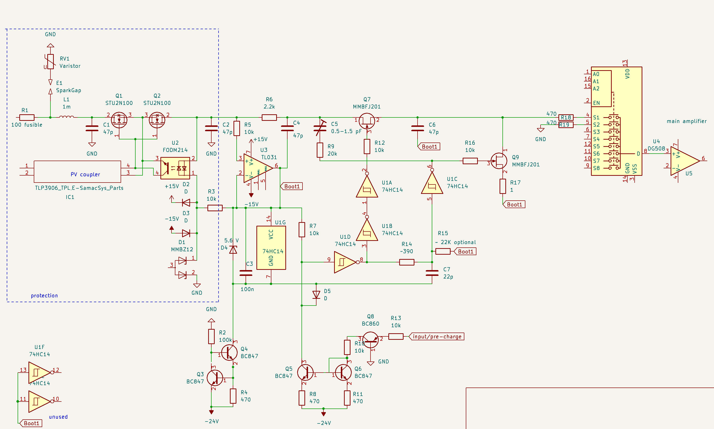
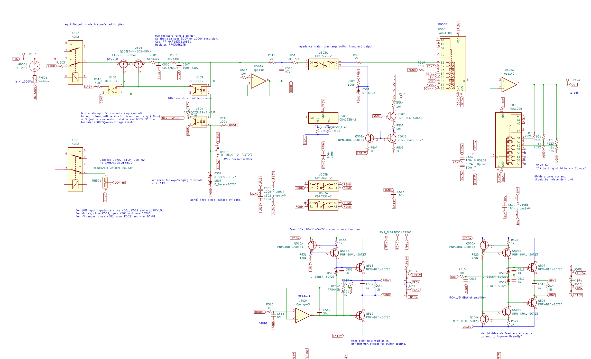

# DCV前端
> TI 建议使用多种不同类型得多路复用器，**MUX36D08**替换**MAX328**这两种器件的额定漏电流在 25 °C 时约> 为 1  pA，但 TI 器件的通道电阻低 20 倍

**jfe2140低偏置电流噪声低，而且匹配度非常好，缺点是输入电容略大**

> R6581T **没有预充电阶段有相当多的来自自动归零周期的充电脉冲**

> 一个需要做出的重大决定是要使用**零漂移放大器(通常作为 OP-amps)**还是希望直接在输入端进行自动零点切换。两种方式都是可能的，而且各有利弊。即使有预充电，**自动归零开关也会产生开关尖峰。这些脉冲比 AZ 运算放大器少**，**但对于可变电压，尖峰往往更大且更难抑制**。

> **R6581T 8.5**没有预充电阶段，此外，输出侧的 JFET 开关栅极驱动不太好，这可能会**增加来自开关的充电脉冲**。  
> **34401 6.5** 使用**预充电阶段**，但在那里**没有额外的微调**。因此，预计**充电峰值会好很多**，尽管没有单独的修剪。  
> **HP3456 6.5**使用**预充电和电容耦合部分的调整**，该部分通过**微调器进行调整**。  
> **HP3457 7.5** 在 DAC 的预充电阶段使用预充电和一些偏移调整，可能是为了**修剪充电尖峰**。  
> **HP3458 8.5**具有**预充电和额外的电容耦合补偿**，可**通过 2 个 DAC 进行调整以降低充电峰值**。因此，为了**减少开关尖峰，需要付出相当大的额外努力**  
> **预充电部分相对简单**，在许多情况下，人们需要一个用于保护信号的缓冲区或无论如何引导一些 clamps。这里要记住的主要部分是放大器和开关的对地电容。**在大约 25 Hz 下切换大约 10 pF 已经是一个明显的负载（例如 10 Gohms 范围）**  
问题是，如果需要**额外减少预充电部分以外的电流尖峰**，以**补偿开关本身的一些电荷注入（栅极电荷）**，那么问题就有点了。这里的一个棘手点是**电荷注入通常取决于电压。CMOS 开关数据表中的电荷注入参数通常定义为关断时的额外电荷。在 AZ 模式下，同时具有打开和关闭阶段**。  
3456 中带有**微调器和电容耦合部件**的解决方案仍然相对简单。这些旧电路使用 JFET 开关，**CMOS 开关的情况可能会有所不同**

> 如果可以控制 **MS-ADC，则增加等待时间也没有问题**。问题是 DUT 上的外部电容会延长时间。**因此，在 AZ 切换后稍作等待并不是通用的解决方案**。它可以用于更内部的信号，从而更好地容忍电流尖峰。大部分函数切换通常不太重要：通常可以接受在函数或范围更改后的额外等待。  
**SD ADC 芯片通常已经具有非常低的漂移，可能不需要频繁切换**这使得**在前端使用零漂移放大器**也很有吸引力，因此**不需要或几乎不需要在输入处进行切换的自动归零模式**。**可能的额外零测量可能是更罕见的情况，并且不会与实际输入交替。**
在信号之间交替的**简单自动归零周期**有一个缺点：只有**一半的时间花在输入上**，这基本上使**噪声带宽增加了一倍**。
CD405x 仅限于相对较低的电压（例如 +-5 V）。这**对于 SD ADC 来说**可能已经足够好了，但对于具有+-10或+-12 V 范围的直接输入来说就不是真的了。
此外，**泄漏也可能直接成为 input 的问题**。可能有些零件可以**使用廉价零件**，但不是全部。

> 对于 DMM，**有 2 个“校准”或自动校正步骤**  
它们可能会也可能不会在后台运行。更常见的部分是自动归零功能，用于校正偏移误差。
在**较旧的仪表**（例如 HP3455 和 Keithley 19x、Keithley 2001）中通常发现的第 2 点是**对 ADC 增益漂移的校正，也可能是对放大器增益的校正**。**这些仪表不时或在每个转换周期中也测量稳定的参考电压（例如 7 V 或相当稳定的 2 V（例如来自 PWM 或电荷泵的 7 V/4）**。
一些较新的仪表，**如 HP3456、3458，不使用ADC增益的周期检查。3458 仅在单独调用的 ACAL 程序中执行此操作**。
摆脱常规增益校准的要点是拥有**非常稳定的电阻，这样增益就不会漂移那么大**。
包括**进行内部 ADC 增益校准**的选项仍然有意义。  
对于**多斜率 ADC**，对于多斜率ADC，通常没有在中间或后台运行的秘密额外线性校正。可能有一些工厂校准，也可能有特殊的测试来纠正一些更突出的INL错误。这可能是正负两侧的分离增益，也可能是一个小平方项。HP3458 ADC有一个看起来有点奇怪的零点校正硬件——根本不知道如何使用以及是否使用，因为它也可以关闭。我怀疑这弊大于利。  
至少对于我的 MS-ADC，**我不需要任何额外的数值校正来获得良好的 INL**。唯一的一点是在额外模式下测量慢斜率与快斜率之比和辅助ADC比例。这不必经常重复（更像是一次或一年一次），也不需要额外的硬件。  
3458或其他高性能多斜率ADC没有真正的魔力。这是一个谨慎的设计，以避免导致可避免的**噪音和INL的错误**。有几种设计达到了8位数的水平：HP3458、Solartron 7081（**尽管有点慢**）、R6581（**经过一些数字校正**）、Keithley 2002（**尽管只有8位数**）、**Datron 1281和后续的Fluke仪表**。  
3458的直流前端与3456没有太大区别，主要是更好的部件和更复杂的开关尖峰减少。
前端选项主要有两种类型：在输入端**3458、R6581 使用 1 级放大器或某种斩波稳定放大器在 AZ 处一直切换，然后才自动归零** **K2002、Datron1281 使用 2 个放大器/缓冲级。HP like 1 级设计的难点在于保持较小的开关尖峰。因此，电荷注入不仅仅是一个小细节**  
**斩波器稳定方式的难点是保持较低的偏置电流和电流噪声。噪声最低的 AZ 运算放大器具有相当高的偏置。斩波放大器部分的切换更频繁，但优点是它位于 2 个非常接近的电压之间**。

> LTC1043 数据表和应用说明讨论了**电荷泵补偿的局限性及其受输入电压的影响**。正如 Kleinstein 所建议的，**分立设计应该能够在较宽的输入电压范围内提供补偿**。  
大多数电路并不关心它，但是**当源头有自己的电荷泵送并且频率接近时**，它确实会出现。结果可能是**缓慢变化的失调电压**。大多数情况下，我在尝试用**一个万用表测量一个万用表的输入电阻时会看到它**，在这种情况下，我可能会分出我的一个旧万用表，它使用线性输入级，没有电荷泵浦来进行测量。  
这与**早期和一些现代斩波稳定放大器在处理接近其斩波频率的 AC 信号时遇到的问题相同**。

> **低泄漏二极管是可用的**，但是由于需要额外的测试，**它们的价格溢价很高**。JFET 会定期进行栅极泄漏测试，**因此它们通常或总是比经过测试的低泄漏二极管便宜**。2N4117A/2N4118A/2N4119A 低泄漏 JFET 通常用于此目的，在 25C 和 20 V 电压下测试的最大栅极泄漏为 1 皮安。**非 A 版本经测试的最大栅极泄漏为 10 皮安**。

> 这是 input 切换保护的一种可能方法。这两个部分原则上是独立的，尽管它们共享用于自举和保护的运算放大器 （U3）  
ESD 保护尚未达到 100%，因此这更像是在实验室中小心使用和低噪声，而不是坚固的设计。**使用 MOSFET 和光伏栅极驱动器进行保护的理念借鉴了 K2000 或 K2001 等吉时利仪表**  
开关速度相对较**快**，因此电流尖峰相当**短**，但峰值电流较**高**。这个想法是为了获得**更有效的滤波**，从而减少外部电荷脉冲。
相比之下，HP3458 使用**相当慢**的开关（转换速率约为 5 V/μs，因此瞬态约为 1-4 μs），这可能是因为用于**调整电荷补偿的 DAC 的速度有限**。不确定他们是使用**固定设置**还是使其与电压相关以**补偿非线性栅极电容**  
**快速切换使数字配平变得困难**，因此旧式可变盖。  
通过 **C5调整栅极电荷补偿**可能有点棘手，原因有 2：  
1） 测量**小瞬变**可能不容易 - 理想情况下，没有太多的**瞬变到达输入**。  
2） **C5的电容非常小，寄生电容会增加它**。这个范围内的修剪器不多。  
在仿真中，**C5希望 J201 FET**的值约为 0.55 pf。  
调整、**C7 的延迟和滤波（C4 和 C6 的值）会影响瞬态充电脉冲以及输入电流泵浦**。因此，如果关闭，它可能会导致**输入偏置电流**。  
由于**寄生电容和类似效果，一些电阻器/电容器可能必须在实际硬件上进行调整**。  
滤波电容器** C4 和 C6 **朝向保护/自举信号，因为**来自栅极驱动的电荷脉冲**也来自那里。因此， OP-amp 不必驱动快速尖峰。  
由于这些电容器，来自 **U3 的噪声可能会对电流噪声产生一点影响**，但主要是较高、高频的部分。因此，为 U3 使用低噪声放大器可能是值得的。  
末尾的 **CMOS mux 只是一个示例类型**。如果确实**需要第 2 个通道**（例如高压侧欧姆感应）可以使用类似的**预充电方案**。  
对于**高压分压器**、我会考虑一个**额外的 AZ 运算放大器作为缓冲器**。这样就可以**避免自动归零开关尖峰，并且开关不那么重要**。  

> 该原理图有助于阐明**信号/预充电开关作为独立模块工作**。并且，如果需要进行测试，它可以**独立于信号/零开关进行切换**。此外，**电流镜像和公共基极 pnp 如何用于浮动开关控制**。
大概可以**检查效果并参考 AZ/无预充电测量进行微调** - 随着时间的推移会有一些平均 - 由于没有** AZ 切换的额外闪烁噪声**？  
关于 jfet 的一般问题 - 按顺序执行时，**导通/捏断**这两个动作是否倾向于**取消栅极电荷注入**？  
可能互补的 trimmer cap 方法也可以应用于 CMOS 多路复用器，以提供精细的调整。我注意到，LTC1043数据表指出，芯片经过调整，因此当信号输入为 **VDD 的 50%** 时，内部 **NMOS 和 PMOS** 电荷平衡。  
这表明在 CMOS 多路复用器中，通常**有可能通过稍微调整/偏移自举 VDD **到信号（例如，信号可能接近 **VDD 的 50% 或接近 GND**） 来修剪 nmos/pmos 的相对贡献  
互补驱动电荷补偿的上限很小。这是非常有前途的。**如果可以模拟电荷注入**，**那么 jfet （相对于 muxes）似乎是一个真正的优势**。

> 许多CMOS开关内部都针对**小电荷尖峰**进行了补偿。JFET和MOSFET的栅极电容都是非线性的，因此**补偿通常只在固定电压下有效**。在此应用中，调整CMOS开关电荷补偿的更实际的方法是**通过相对于信号的电源**。电荷注入接近零的电压取决于芯片——它可以在中心或一端（通常是负极）
3个可能的候选芯片是**ADG633和TMUX1134，可能是max4053**。74LV4053的1/3可能有效，但泄漏规格非常宽松，因此需要进行测试/选择。
我不确定JFET的CMOS解决方案是否更好。**对于CMOS开关，我发现很难找到同时具有低泄漏、低电荷注入的合适开关**。特别是**单开关往往具有相当低的电阻，因此泄漏和电荷注入更高**。可用性是另一个问题。有了合适的芯片，**CMOS解决方案可能会更容易，需要的额外修整更少**  
JFET**开启和关闭**的应予以补偿。然而，开关两侧的阻抗决定了电荷如何分配到两侧。另一点是，**充电脉冲在一定程度上（栅极电阻有点帮助）遵循非线性电容**：在过渡开始时，**通断时往往有更多的电流，而在接近结束时，通电时往往有更大的电流**。因此，对于2个JFET之间的点，总电荷可以补偿，但仍然有第一个电流从关断流出，然后是另一个方向的电流。**因此，即使补偿调整得当，也会出现电荷流入和流出的瞬态，即使总和为零**  
**对于测试，可以使用更频繁的开关**（例如 kHz 范围，而不是通常的** AZ 周期的 2-25 Hz**），尤其是对于电流。这最初让我在仿真中感到困惑，**因为那里的频率要高得多，因此电流也要大得多。对于单个尖峰，滤波较少的测试点可能会有所帮助**，但 is 也可以反作用并影响电流。

> 74LV4053，那里的**漏电流相当低**3 个开关和 2 个 OP-amp 约为 10 pA。这是一个便宜的零件，因此测试限制非常宽松。  
这是**大多数 CMOS 开关的常见情况**。限制规格非常宽松。即使**使用 JFET**，也只有**少数零件**真正经过了非常低的泄漏测试，尽管典型规格还可以。  
可能不得不按照这里的**典型规格进行设计**，而不是选择或冒险。  
在实际用例中，**开关两端的电压非常小，栅极电压也更适中**。因此，条件并不像大多数规格那样糟糕（例如 JFET 的 -15 V 栅极电压或 CMOS 开关两端的电压接近全电压）。  
引脚排列是为了使引脚 3、4、5（第 3 个开关）可用于开关，引脚 2 和 6 可以是芯片的 GND。所以至少有对外部的保护，只是在 switch 元件本身之间没有。开关的一端本质上是防护罩，然后启用一个开关。因此，开关的 3 个引脚之间不需要额外的保护。

> 以下是 TI LV4053 V MAX4053A、信号调节预充电开关的一些数据。  
该开关以**高频驱动**，以尝试**揭示不同自举轨偏移和不同源信号阻抗的电荷注入偏置**。  
并希望避免捕获任何其他内容，例如由于 PSRR 不佳而被**调制到高阻抗源上的 ctrl 信号**。  
存在一个问题，即操作路径的 Vos 不同，当使用 DMM 进行测试时，我们通过缓冲器连续采样——包括预充电和无缓冲信号。实际的 implementation 只会对 signal 进行采样。但我认为这可以进行演示，因为在快速切换时， op Vos 差异会被 switch 寄生效应所淹没。

                   90/10  duty cycle sig/charge 
                   Values are mV.
                   bootstrap VSS rail          freq
                   relative to Signal.
                   off     100Hz      1kHz      5kHz

    SN74LV4053ATDRQ1 soic

            0V      100k    -0.009    0.013      0.035     0.123
                    1M      -0.006    0.036      0.230     0.574
                    10M      0.019    0.27       0.23    -6.75

            -0.5V   100k    -0.009    0.014      0.050     0.210
                    1M      -0.014    0.035      0.375     1.55
                    10M     -0.06     0.280      2.17     5.55

            -1V     100k    -0.009    0.014      0.056     0.247
                    1M      -0.017    0.042      0.45      2.07
                    10M     -0.08     0.33       3.50     14.0

            -2V     100k    -0.011    0.012      0.048     0.212
                    1M      -0.19     0.032      0.039     2.23
                    10M     -0.102    0.24       4.75     27.4

            -3V     100k    -0.011    0.011      0.031     0.124
                    1M      -0.020    0.014      0.230     2.06
                    10M     -0.011    0.05       5.66     41.5

            -4V     100k    -0.009    0.008      0.005     0.006
                    1M      -0.020   -0.012     -0.012     1.50
                    10M     -0.125   -0.215      5.88     52.4

    MAX4053AESE soic

            0V      100k    -0.042   -0.029     -0.075    -0.303  (reads a bit high due to op amp temp drift from soldering)
                    1M      -0.036   -0.023     -0.071    -0.300
                    10M     -0.033   -0.020     -0.068    -0.297

        -0.5V       100k    -0.029   -0.069     -0.580    -2.867
                    1M      -0.135(?)-0.672     -5.709   -28.43
                    10M     -1.049   -6.466    -57.40   -279.0

        -1V         100k    -0.020   -0.099     -0.945    -4.717
                    1M      -0.075   -0.981     -9.305   -47.365
                    10M     -0.56    -9.267    -84.121  -482.02

        -2V         100k    -0.018   -0.148     -1.473    -7.366
                    1M      -0.056   -1.479    -14.451   -72.79
                    10M     -0.41   -10.91    -100.17   -716.84

        -3V         100k    -0.016   -0.189     -1.900    -9.512
                    1M      -0.043   -1.882    -18.596   -92.042
                    10M     -0.300  -10.88    -105.99   -886.7

    identical board setup (dual soic/tssop footprint) as previous two tests .

                   off      100Hz       1kHz     5kHz
    ADG633  tssop

    0V      100k    -0.005      -0.012     -0.190    -0.987
            1M      -0.005      -0.184     -1.915    -8.746
            10M     -0.005      -1.88     -15.41    -61.5

    -100mV  100k    -0.006      -0.073     -0.778    -3.977
            1M      -0.006      -0.774     -7.681   -38.39
            10M     -0.009      -6.89     -69.24   -354.

    -1V     100k     -0.013     -0.536     -5.3     -26.                                        dec 29. 2022.
            1M      -0.014      -3.090    -30.9    -252.
            10M     -0.020      -14.4     -497.     2417.

> 一个有趣的测试。正如预期的那样，额外的电荷注入最适合 supply 中的低 offset ，因此接近 switch chip 的负 supply。因此，人们可能没有额外的偏移，或者只有几个 100 mV 的小偏移。  
输入电流似乎是合理的低：**4053 约为 3 pA**。max4053 的情况可能受到漂移的影响，但看起来仍然不错，但有些不确定，因为 100 K / 1 M /10 M 情况的**偏移可能会有所不同**。  
电荷注入导致的**额外电流看起来仍然正常**：例如，LV4053 在 100 Hz 时约为 30-40 pA，因此净电荷注入为 0.3-0.4 pC。直流测量的实际用途更像是 25 Hz （1 PLC）。对于 **max4053**，它看起来更低（例如，1 kHz 时为 30 pA 范围）- 但**如果仍然漂移，则有点不清楚**。
如果输入端的电容相对较小，则电荷脉冲可能会导致比 DMM 平均值更多的电荷峰值。  
到目前为止，这两个开关对于 **DMM 输入看起来都是可以接受**的。我**仍然更喜欢 max4053**，因为它的特性更好。  
有机会从 control 信号获得耦合。我不会太担心 **PSRR 和与电源的耦合**，而是更担心**与输入的电容耦合**。当**电压跳变 5 V 时，只需几分之一 pF 即可获得 pC 充电脉冲**。  
除了电阻输入，还可以在输入端检查电容器（例如大约 10 nF PP 或 PS）。**输入偏置/充电脉冲会慢慢地为电容器充电并转换为漂移率**。  
这也将使充电脉冲变得平滑。完整的前端可能会有一些对地的滤波电容（例如 20-200 pF 范围），这**也有助于 ESD 和 EMI 保护**。

> LV4053 的新数据看起来非常好。**如果 input 端的脉冲足够小，这将是一个不错的选择（可能仍需要额外的低泄漏测试）**。
这至少是最简单的解决方案。
**JFET 版本更费力，但可能泄漏更少**，并且有更多调整/修剪选项。

> 由 **PV 光耦合器驱动**的 FET 应该对 RF 干扰相对不敏感，因为它们要么完全关闭，要么完全打开。
PV 光耦合器提供浮动电源来驱动 fet。这基本上是 Photomos 继电器内部的电路，只是部件分开，因此**来自 LED 的热量可以与信号路径和可能的热电动势效应稍微分开**。  
低压继电器并不是那么重要 - 它甚至是可选的。用于保护的 MOSFET 级也可以用作开关。继电器会更能减少泄漏。即使关闭 FET，**503/504 仍可能具有 GOhm 范围内的电阻**  
对于高压继电器，如果需要，可以使用**2 个串联触点**。这与从输入到分频器的路径无关，而是从分频器到 ACAL 信号。    
为了防止 **ESD 的快速尖峰远离 MOSFET，应该有一些串联电感（例如 100 μH，可能更多）**，理想情况下，**在 FET 之前也应该有一些对地电容**。
**高压分电阻 和 低压继电器接地电阻器**是有意义的-它们**不必是金属膜或低噪声**。关键只是**低热电动势**。关于热电动势效应，电阻变化很大，除了良好的分流电阻器外，没有找到太多数据。    
同时为 **ACAL 提供正信号和负信号并不费力** - 低电压信号的工作量可以是 HC4051 或模拟信号。它可以帮助平均2个点以上，这样可以减少 ADC INL 的影响，并在自检中提供额外的检查。所以我认为值得付出一点额外的努力。  
**在 MUX 中可能需要更多的 input paths**。我会考虑使用 **4051 来接收低电压信号（+-1 V、+-100 mV、温度传感器、电流范围的可选分流器）**。另一个多路复用器（例如 DG408 或 ADG1208）可用于不太关键的信号，例如**分频器的 ACAL 信号、缓冲信号（例如欧姆感应 L、低电流 TIA）。分离到 2 / 3 rd mux 还有一个优势**，可以更好地隔离开放的、未使用的输入，这些输入会拾取嗡嗡声。根据电流范围的实现方式，可能没有多少备用输入。  
对于**增益设置电阻器**、我**不会真正考虑 Caddock HV 阵列**。它们非常昂贵，并且由于是**厚膜**，因此可能会很吵。
**VTF330 看起来不错，噪音方面很可能很好或至少足够好**。如果真的需要获得更低的电阻，可以选择**并联 2 个这样的数组**。
总电阻是自热的非线性和噪声之间的结果。这**主要影响 1 V 范围，但影响不大**：在当前计划中，**R501 和 R502 已经提供了 10 K 的电阻，这导致了噪声**。  
增益设置电阻器还有一个选择：可以使用更多数量的相等电阻器。10串联，1和9并联，**比例为100:10:1**。20个相等的薄膜电阻器也不算太差，**虽然通常不指定匹配，但通常很好**。电阻器的TC规格通常适用于相当大的范围，性能更相关。20-40C范围通常要好得多。这**也适用于VTF330**  
4053 很可能在**输入和输出侧都应该具有匹配的电容器**。可以使用一些不同的值来稍微修剪/移动电荷注入。所以肯定应该有脚印，即使以后可能不会使用。**我怀疑 R518 会有什么用处**。如果有的话，用于 C1 input 的 resistor 可能有用。  
为了将电流保持在 C503[入口电容]和4053的电荷喷射局部到浮动电平，我宁愿不要为自举电源提供额外的运算放大器。所以 U501 将直接驱动 4053 的地面侧。为了减少来自控制信号的交流电流，可以使用从 4053 GND 到原始控制信号 （TP501） 的串联 RC。R506 应该与 R509 相同 - 可能更多的 100 K 可能是 47 K。这样，U501 应该不会看到相关的快速电流尖峰，而电荷尖峰应该主要保持在本地。  
对于**接地，区分电源接地、无电流信号接地和有电流信号接地是有意义的。如果可能的话，甚至应该补偿接地电流（例如，对于来自增益设置电阻器的电流）**  
对于主放大器、**OPA140的线性度可能不够好**。我没有测试过 OPA140、但对于速度较慢的兄弟 **OPA145、当用作缓冲器时、我看到大约1-2μV 的输出交叉误差**。**当与 gain 一起使用时，此误差将非常高**。可以在具有第二个 OP 的复合放大器中减少此输出交叉误差以驱动输出，尽管这对于相当快的 OPA140来说有点棘手。另一点是有限的** CMRR：规格仅为 140 dB（典型值）/126 dB 最小值**，**并且不能保证优于 0.1 ppm INL**。它可能仍然是 Ok，因为 CMRR 的线性部分不会导致 INL 误差，而只是增益的微小变化。**问题是我们不能假设 OPA140足够线性**。  
当与 **CMOS MUX 一起使用来切换增益时**，对**地寄生电容会导致稳定性问题**。因此，在**增益设置电阻上可能需要额外的电容来补偿**。  
我看过**3458中使用的放大器电路**。其优点是**自举输入JFET相对容易（与自举运算放大器相比）**。**额外的输入级增加了整体直流增益**，并**允许在输出级等线性误差交叉时进行更多补偿**。JFET上带有电感器的部分是不寻常的，但它是有意义的，**至少对于1的增益来说是这样，对于10的增益来说只是边界线。它降低了最高频率的增益**，这种方式有助于提高稳定性（需要100 MHz范围的GBW）。然而，**我仍然不理解增益为100时的稳定性——简单的分析显示出振荡的趋势**。也许用于**增益切换的JFET的容量可以挽救局面**。

> 非常感谢您的详细评论和评论。**专注于放大器**，这可能是一个主要的弱点。  
我知道**自举 jfets 在概念上等同于自举运算**，同时增加额外的增益，并为合适的更大 jfet 开辟选项。  
**JFE2140可用。漏电流规格与 opa140 Ib 相同 - 最大 10pA。  
如何计算长尾对级的电压增益/CMRR 贡献？  
JFET 采用公共源极配置，无论如何都具有高电压增益。 
那个。通过**删除 op 和 feedback 并输入一个小的 differential offset**，可以在 cascode 配置中模拟 ltspice 中的 gain。100uV. -> 13.15 - 12.98 V. == （13.15 - 12.98） / 0.0001 == 1699x 增益。
Draft53.asc 暂时无法仿真

> 保护部分理想情况下以线性方式限制电流。因此，在**过载时，将有一个基本恒定的电流**，刚好足以对抗来自 PV OK 的相当小的电流（例如 5-10 μA 范围）。至少在我的设置中它不会振荡。导通速度应该不重要，我预计大约100 μs 左右，具体取决于栅极电容。在电流中有一些超调时，零件的转弯可能会更快。本质上就像放电 2-3 倍的栅极电荷。到目前为止，我的计划是使用一对比较器或类似器（在窗口比较器模式下的 μC 中的快速 ADC ）检测主放大器输出端的溢出。  
计算 JFET 级的 CMRR 有点棘手。我主要看到共模增益的3个贡献：  
1）**源侧电流源可能并不理想。由于 FET 跨导不匹配，电流的变化将转化为偏移的微小变化**当整体偏移匹配时，跨导的匹配很可能是好的。  
2）由于 **BJT 的早期效应**，增益随 CE 电压而变化。**2 个晶体管之间的这种效果的差异将决定整体效果**。我仍然认为人们真的**不需要特殊的 LM394 匹配晶体管**。  
3） 随着输入电压的变化，电流源和用于自举的 BJT 的功率耗散将发生变化。这可能会产生次要影响。总和，功率将保持恒定 - 因此理想情况下，这些晶体管可以是耦合的，并且与其他晶体管有点分离。    
长尾对增益与跨导增益相关，而不是直流电压增益。在这里，引导部分基本上没有效果。跨导应为 1 / （1/g_fet + R_s）。
带有 OP-amp 的放大器的 GBW 是根据跨导和反馈电容设置的。
有关详细信息（例如，寄生电容和两侧不相等电容的影响，最好进行仿真）。
与源电阻器并联的电感器为较低频率提供额外的增益。1 K 和 680 μH 的交叉频率约为 230 kHz。这有助于更快地建立，而无需放大器的整体超高 GBW。它还有助于获得高转换速率。电感器的缺点是它们往往不理想，并且可能会拾取嗡嗡声 - 如果它们处于相反的方向，则使用 2 个电感器可能会减少嗡嗡声拾取。   
**JFET 级之后的 OP-Amp 不必是低噪声。JFET 级有大量的电压增益**。所以原则上 TL071 应该可以工作。对于更高的转换速率，**TLE2071** 可能是候选者。如果 OP-amp 可以在正电源附近工作，这会有所帮助，因为 OP-amp 的 CM 电压大约与上轨相差 1-3 V。  
对于电压表部分，**实际上不需要放大器的超低噪声。准备好的保护和其他电阻器会产生相当大的噪声。主要是可以使用放大器低噪声的分流器**。因此，在噪声方面，**无需使用 JFET2140**。由于具有良好的匹配（<5 mV 否则是高级等级）和低偏移，这仍然是一种选择。**与其他双 JFET 相比，它们仍然相对便宜，尽管还有其他便宜的 JFET（例如 SK2145）**。

> 我对**CMRR**进行了一些仿真，以了解不同晶体管的贡献有多大  
仿真的思路是**只查看分立构建阶段**，用相对较小的电阻加载它。所以没有**OP-amp**和反馈。  
输出信号是通过该额外电阻器（计划中为 R1）的电流，通过电流输出，**可以在没有外部反馈的情况下使用 JFET 级，这样可以轻松施加共模信号（两个 JFET 门获得相同的信号）**  
这种**差分驱动情况提供差模跨导增益（在我的情况下约为 -50 dB）**。  
概念化的基线配置使用 **P-MOSFET 而不是 PNP 作为 BS 级电流。这消除了大部分非对称性，尽管它在现实生活中可能不实用。
电流源带有 N-mosfet。为了包括 JFET 不对称性，右侧需要一个 10 欧姆的源电阻器。我会考虑这个相对较大的失配（ ~ 10% 电流，因此 ~ 5% 的 g ）**。  
概念化基线电路获得非常好的 -202 dB CM 增益，因此 -152 dB 的 CMRR（与 -50 dB 差分增益的差值）。  
测试是在 PNP 位于顶部，NPN 位于当前源，共源不匹配。  
使用 PNP 为 2N3906，NPN 为 2N3904，电流源中的 BJT 获得的 CM 增益比顶部的 PNP 多（-187 / -179 dB CM 增益） CM 增益的大小取决于 JFET 中的不对称性 - 没有不对称性（电阻器），基本上没有 CM 增益。  
正如已经猜到的那样，这两个部分的线性部分具有相同的相位，而非线性部分的相位相反。因此，可能会有一些补偿，但不会太多，因为当前源的影响似乎要大得多。对于非线性部分，使用不同偏移 （+-5 V） 的 CM 增益。  
共源共栅晶体管失配的影响可能相对较大，**对于 2N3904 / BC547B 配对的 CM 增益达到 -164 db**，**因此 SMRR 仅为 -114 dB。该效应也与直流电压有关，因此是非线性的。**一对相同类型的晶体管可能比 2 种不同的型号更好，这会导致发射极电压差为 18 mV。在 2 个 transistor 中获得合理的良好匹配仍然是有意义的。    
在 Julian 的旧仿真文件中，**我发现由于 ADA4625 的模型可能有故障 （GBW ~100kHz） ，因此响应相当慢。我的 LTSPice 版本不是最新的，因此可以同时修复它**。
JFET_amp3458_CMbaseline.asc   
JFET_amp3458_CM_NPNs.asc 

> **JFET 前端之后的放大器不再那么重要**，因为 **JFET 部分有增益**。所以**噪声和偏移漂移并不是那么重要**。如果**放大器的共模范围相对较大**，则它会有所帮助，因为输出信号相对靠近上部电源（例如，来自正电源约 1-2 V）。
因此，**不需要 OPA140和 AD4625，并且共模范围稍有限**。OP27 还可以（尽管 SR 有限），但更矫枉过正，而且在共模范围内也不好。AFAIK MC34081已过时。如果需要高转换速率和 GBW，我会考虑 **TLE2071 / TLE2081**。

如果放大器使用额外的级作为输出，使其成为复合放大器，也可以使用较慢的放大器，例如 TL071 / LF353。output stage 将为具有增益的情况提供额外的速度。

> 我完全同意**首先整理出 1 个 OP-amp 版本**。**2 OP 放大器版本主要是为了稍微加快 x 100 外壳的速度**，使前端部分更像 x 10 外壳。因此，**它仍然需要 1 个 OP-amp 版本才能正常工作**。即使添加了第 2 个 OP 放大器以获得更快的速度，FB 分频器的补偿也应该大致相同。**第二个运算放大器更像是使 JFET + 电感器部分的补偿更容易一些，因为该部分不再看到有效增益的如此大的变化**。  
即使**只使用 1 个 OP 放大器版本，使用 ADG1209 而不是 ADG1208 也会有所帮助 - 仅仅因为电容较低。我已经看到不需要 4 次增益设置**。  
选择补偿是很棘手的。我的计划中显示的值是我获得的当前状态。部分电容器是 bodged on，有点以尝试和错误的方式。我目前还有一些小电容器可以提高稳定性，但仍然不是很好。驱动低侧也增加了复杂性，故意有点慢的响应对我来说还不错。  
用随增益设置变化的开关的相当多的电容来计算是很棘手的。因此，更理论化的方法是从模拟中通过一种尝试和错误来找到合理的折衷方案。单个分隔链不会得到完美的解决方案，而只会得到一些妥协。最好的办法是用相当多的并联电容淹没开关电容，而不是为电阻和电容部分获得相同的分压比。尽管如此，大电容器会增加运算放大器的电容负载，这也不好。
这还不错，因为在没有开关电容的情况下，**对于1：10：100的增益，电容器的比率约为1：10：90**，因此输入电容不会太大。  
所以可以从 **3 pF / 22 pF/ 180 pF** 之类的东西开始。开关电容特别增加了第 2 个电容器，因此在开始时增加了一个稍大的电容器。****时间常数仍将在 300 ns 范围内**，因此足够快以获得良好的建立时间。  
**单独的分压器会使事情变得容易得多，但会导致更多的接地电流/电容。人们可以计算出具有理论上近乎完美的结果的适当补偿。**  
人们可能**只是接受 x 10 的情况会变慢一点**，并且只为第 2 级使用 2 个增益设置：x 1 表示总增益为 1 和 10，然后增益约为 10 表示 x 100 的总增益。这将为**第 2 级留下只有 2 个设置的简单情况，因此很容易在那里进行补偿**。  
对于输入放大器电源自举的电路，由于 AZ 放大器的电源和输出范围有限（5 V），此选项将不起作用。还需要第二级的增益才能获得完整的输出摆幅。额外的速度更像是一个次要的 nice to have 部分。所以我没有那个选项，需要相对较高的第二阶段的增益。另一方面，**我不太在乎快速稳定**。所以情况有点不同。

>  3458A 有许多用于输入多路复用的并行 JFET，尽管这可能反映了设计时可用的元件选择（**无低泄漏/多掷开关**）。  
我没有考虑过这一点。**DCV 可以从用户端子输入为 +-11V，所选多路复用器输入为 0V**，BOOT 处于相同电压。
这对泄漏不是很好。
即使关闭保护 fet，fet 泄漏也在 nA 的数量级，因此它们不会有太大帮助。

> 泄漏数据很棘手。规格限制 （= 测试限制） 和典型/实际泄漏之间通常存在很大差异。**严格的测试似乎很昂贵，因为它只需要时间 （以便 DA 可以建立）来测量 pA 范围电流**。所以便宜的零件往往有松散的规格。这也适用于 CMOS 和 JFET。  
将**单晶分离为关键的低泄漏信号和不太关键的信号是一个好主意**。通常只有几个关键信号，因此只需要几个（例如 **3 -5 个）真正的低泄漏开关**。对于某些信号，灵敏度较低的信号（例如 ACAL 电平、分流信号、缓冲信号,...）可以比使用普通/廉价的 CMOS 开关（**如 DG408 / DG211 甚至 HC4051**）来传输。  
**JFET 在导通时基本上应该没有泄漏**，因为基本上没有栅极电压。他们仍然需要花费更多的精力来处理**额外的栅极信号以及 LM339 等驱动器**。当关闭时，**泄漏预计是一个大约恒定的电流，对电压的依赖性很小**。CMOS 在关闭时可能泄漏略低，但在**打开时可能存在栅极泄漏**。此外，还有保护二极管。  
部分漏电流也可以补偿。在某些情况下，**DMM 具有额外的 JFET，用于箝位至正电源，这也可以补偿一些电流**。  
自举的预充电电路应该提供**基本固定的漏电流**，因为芯片的电源是自举的，因此条件是固定的。到目前为止，我看到的泄漏很低（~ 5-10 pA），尽管 LV4053 的规格根本不严格，并且允许更高的泄漏。原因 泄漏 可能会有所不同。  
在我的概念中，我有 2 点可以减少一点开关：  
1）我**没有在预充电部分使用 MUX**，因此为不同的来源（电压输入）提供 2 个单独的预充电部分。  
2） 高压分压器有一个**单独的 AZ 放大器作为缓冲器**，因此会形成一个**相当敏感的信号，而一个非关键的信号用于开关 **

> 一些独立的开关泄漏测试。
在向（开/关）输入引脚施加高阻态、+10、-10V 电压时，测量模拟开关（adg1208、dg508）输出 gnd 的电流泄漏。
结果相当不错  
**adg1208**  
测得的rds（on） 111R 
固定漏电流，大约在**0.5pA** 左右。铜保护保持浮动，因此可能会从电路板 PWR/Ctrl 引脚泄漏到保护，而不仅仅是内部 FET 栅极/保护二极管/衬底泄漏  
输入时+-10V 提供 **+-0.5pA**允许大约 20 秒的建立时间后输出电流的变化  
行为是相同的 - **无论所有 ctrl 引脚都是 lo - 还是 EN 为 hi 并且未使用的 input 引脚被激活**。
这表明 EN 引脚仅用作 logic ，**不控制某些全局额外的内部隔离 fet**。
**DG508**  
rds（on）=295R.  
大约**1pA 固定漏电流**（保护保持浮动，因此可能会从电路板 pwr/ctrl 引脚泄漏）和+-10V，**在输出上给出可能+-0.1pA**的电流差。非常难以衡量。  
我有 max328，但可能不会测试它，因为它需要更好的设置/DUT 屏蔽以及自动化/脚本化操作。  
但是，我认为**这足以支持它们而不是 jfets/继电器**，因为**保护缓冲区的-Ib 已经预计约为1pA**。  
而且**浮动预充电开关的泄漏预计还会更高**。  
输入继电器多路复用**已重新组织，以改善 ACAL 功能期间的端子隔离**。  
这还有一个额外的好处，即减少泄漏对关键高复用器的泄漏/非线性影响。  
当前，**当特定的 DMM 功能/模式未激活时 - 与该功能对应的输入引脚上的信号保持高阻态、处于引导电位或衰减**。
当前 -
- 当**不使用 DCV 时，输入继电器 k405 打开，输出通过输入保护（通过自举箝位二极管）保持在引导电位**。
- 当次要**重要性/缓冲信号 （REFS、电压源、TIA） 信号未使用时**，第二个多路复用器输出保持在引导电位（通过在其输入上复用 BOOT）。
- 当不使用 **DCI-HI** 时，电流输入/保护/交流继电器开路（K702 和欧姆源继电器）并且输出为高阻态。
- 当不使用 **DCV-DIV** 时，K402 开路，输出为高阻态。如果使用具有 10M 输入阻抗的 DCV，则 DCV-DIV 在多路复用器处衰减 100 倍。  
- 当不使用 4W-hi 时 - 欧姆电流源继电器关闭。如果操作员在 2W 或 DCV omde 状态下将 4W 电缆连接到 DUT，则测得的电压将复制到两个多路复用器输入引脚上。但这可能是一个 OK 的边缘情况。
- 存在一个问题-是否应将非有效/未使用的输入引脚电压从保护缓冲器电压切换到 agnd/0V.
因此，在电流测量模式下，DCV 可以保持在 AGND/0V （通过自举箝位二极管） - 而不是遵循 DCI-HI 的保护缓冲器。
对于 secondary-importanace hi-mux，它可以遵循 AGND/0V，而不是 boot。
即使只是作为测试/诊断，我认为这将是有用的。
- 电流范围已经有一些保护开关 - 例如。在分流范围内，引导/保护遵循分流电压，但如果接合 TIA，则它遵循 agnd/0V。

> SD ADC 芯片和老式多斜率 ADC 的前端确实不同。这与开关/电荷注入无关，而是电压范围。MS-ADC 通常设计为在相对于接地的 +-10 V 输入范围内工作。SD 芯片通常具有差分输入，某些类型需要真正的差分驱动才能使用全范围（例如 +-5 V）。即使其他 ADC 芯片不需要，**差分驱动也可能有助于提高线性度**。保护和输入切换有一些共同点，但它更像是一个单独的主题，可能值得单独讨论。  
**需要的另一点是 ADC 驱动部分-这并不容易，可能会影响 INL**。
PGA280 对于可能具有 6 位数字的相对简单的解决方案来说看起来不错，但输入偏置和线性度存在一些限制，无法真正达到高端。  
除了 **HPM7177 设计之外，还有其他选择，有些应该使用更少的精密电阻器**。所需的精密电阻器数量本身并不是那么糟糕 - 问题在于**是否有现成的合适电阻器阵列可用**。HPM7177设计具有 signle 范围 - **使用额外的增益设置**，我看到更多的复杂性。  
我的 DMM 设计在输入端使用 AZ 放大器，这在某种程度上适合差分 ADC，但它不会增加衰减。因此，范围将小于 ADC 输入，因此 AD7177 或类似范围为 +-5 V（和更小的范围）。从好的方面来说，增益 1 没有关键电阻器。  
对**全差分放大器进行直流稳定可能很棘手** - 至少我没有看到一个简单的方法。无论如何，**具有低输入阻抗的典型差分增益电路对于高精度来说有点受限**，它们**需要 4 个精密电阻器来容纳 1 个放大器**。

> **HPM7177中的精密电阻器数量相当少**：LTZ1000 **2x PTF56 + 3x S102K**，输入分频器和参考分频器有一些网络。就我而言，使用 **TDP1603 代替 Vishay PRND**。
我还没有完全测试我的版本，这需要一段时间。
我也不知道在复合材料设计中使用 **THS/LTC6363 的方法，我宁愿使用 HPM7177 中经过验证的驱动程序**。
关于现代 ADC 前端的新线程是否有意义，我无法判断。
我假设在经过验证的设计作为开源可供多人测试后，这些东西会再次滚动。
附件是我方面的建议，基于**3458A JFET 前端**、增加了基于 **TDP1603 的增益选择和基于 HPM7177的 ADC 驱动器**。由于 **3458A 前端使用了两个未知的双 BJT/JFET，因此需要找到一些符合规格的可用器件**。
它不完整，是否有人注意到明显的缺陷或需要改进的地方？  
编辑：  
将防护驱动器更改为较低的偏置电流 1 MAX9945而不是 OPA140 （LMC662电源范围不适用）。

> 对于分立构建低噪声放大器的 JFET，TI JFE2140现在应该是一个相当不错的选择：偏移、输入偏置和噪声都非常低，并且价格合理。如果想要非常低的热漂移，很可能无需额外的偏移调整即可摆脱，也许可以选择单个电阻器。我认为 DAC 不需要调整偏移，尤其是在使用低偏移JFE24140时。  
建议的计划有几个奇怪的地方：**U5 U9** 的额外缓冲没有帮助，只会增加噪音，可能还会增加一点点漂移。类似的参数适用于 **U3+U6**。  
在不需要它们的地方也有 **AZ 放大器：例如 U8 用于 GND 电流补偿**，**U12/U13 缓冲器用于第 2 个分压器**。这里，**更简单的缓冲器（例如 OPA141）会更好（第一个分频器的偏置较小）**。  
**MC34081 的合适替代品是 TLE2071** - 它还具有扩展到正电源的共模范围，这可能是一个问题。  
在 100 mV 范围内，带有 **RN2 的分压器具有相当高的电阻**。如果追求低噪声，**则可以在此处使用较小的电阻器（可能是 500 欧姆？**
使用 **1：8 MUX 进行增益设置是不好的**，因为**未使用的通道会增加额外的泄漏和电容**。**1：4 MUX 将是更明显的选择。**  
开关电容可能很棘手，**可能至少需要一些补偿电容器**。
采用 **+-12 V 电源的 AD8065 应在输入端设有一个电阻**，以防前**一阶段高于 +-12 V.JFET**  
放大器的 **4 mA 电流对于精密放大器来说太高了**。这很有可能引起**热非线性效应**。对于更大的 nV 仪表，4 mA 可能是可以的。**大范围线性放大器更像是 200 μA 至 500 μA**。  
**电路显示初始部分的方式可能与多斜率 ADC 相同**。所以这并不是一个单独的线程。  
但是，**这样在 ADC 之前没有没有增益/分频器的范围。因此，TDP 分频器网络 RN6 的稳定性在所有范围内都会有相当大的增益**。HPM7177 **为分频器级使用昂贵的定制电阻器阵列是有充分理由的**。   
直接规划用于 ADC 芯片的前端将具有 5 V 范围，没有增益/分频器，然后可能具有带分频器的 12 或 20 V 范围，可能具有 500 mV 和一些 100 mV 增益，但没有分频器。这将是不同类型的前端。所以与其说是受到 3458 的启发，**不如说更像是 SDM3065**。[PAGE6]

> Kleinstein 都是好的地方。  
正如您在使用低偏移 JFET 时所指出的那样，**偏移/偏置补偿**在这里可能不是必需的，这就是为什么它仅作为建议添加的原因。
你说的 **U5/9/3/6** 是不必要的是对的。  
我将 **U9 放在 TLE2081 后面**（3458A Black Edition 使用它，TLE2071猜得不错:-+），**以避免 TLE2081 对其输入晶体管的热负载反馈**，尽管 3458A 显然在没有它的情况下工作得很好。  
**TLE2081/AD8065级可能需要校正**。  
**GND-Compensation-OP 确实可以是通用的**。  
**U12/13：125pA 偏置 * 5kR = ~10nV**，我不知道 id 是否将其与 OPA141的偏移漂移进行交易。  
将 RN2 更改为电阻较低的 460R 变体，该变体也可用。1k 也可能可用，id 需要计算噪声贡献。  
您能**推荐一个 4：1 的低泄漏 Mux 吗**？在我看来，像 **TMUX6111/TMUX6136** 这样的替代品并没有好多少吗？  
复合 OP 级中限制电阻器的优点、之前有点担心它们。  
将 **JFET 级电流从3458A：1.78k 更改为原始值**，相当于 1.4mA，**因此通过每个 JFET/BJT 的电流为 0.7mA**。  
我添加了假设在 3458A 黑色版中使用的 JFET/BJT 的更改和建议，这些详细信息/照片也可以在 xdevs 上找到，如原理图:)
中的链接您  
能否详细说明为什么 RN6 网络与 PRND 相比不适合的原因？我们在这里谈论的是影响功率系数还是其他错误？  
我不会用这个设计去选择 5V 范围。  
虽然它将受益于增益阶段避免，因此具有非常好的规格，但它仍然感觉半途而废。  
如果增益阶段真的需要比TDP1603更好的网络，我愿意在必要时走那条路，我只想避免这种昂贵的东西，如果它没有必要的话。  
我附上了修改后的原理图。

> 侧到差分级的 RN6 网络可以看到相当大的功率，这将**导致热 INL 问题**。4 K 和高达 12 V 的电流为 3 mA。  
为了**将功率保持在合理的水平，可能必须使用更多的 10 K 值**，甚至可能**成为 INL 误差的可能来源**（取决于 TC）。    
对于增益设置，**TDP 网络应该足够好**，至少**线性度和噪声方面是如此**。为了长期稳定性，数据表通常不是很具体。部分问题是有一个 DS 覆盖了很大范围的电阻值。较适中的范围（例如 10 K ）可能比极端范围（100 K 或 100 欧姆）的情况要好。无论如何，**长期漂移规格是很棘手的** - 谁知道一个零件**对多年的老化**和现实世界的热循环有什么反应。**加速测试在一定程度上受到限制**。  
级联运算放大器有多种用途，有时只需一个就足够了：  
- 1） 高频尖峰  
- 2） 消除输入级的热负载 
- 3） 减少对 INL 的负载影响（输出交叉）    
2 个 OP 缓冲级可能需要在 **FB 中为 AZ 放大器增加一个额外的电阻器**。否则**100 pF 对快速运算放大器来说是一个相当大的负载、可能会导致不稳定**。  
无论如何 - 这些是无论如何都可以跳过的阶段。  
**U12/U13** 部分不需要低偏移/低漂移。**与JFET级漂移的10倍相比，该漂移是JFET级漂移的10倍**，并且无论如何都**可以通过AZ周期进行校正**。  
对于**低泄漏 4：1 mux 复用器**，MUX36D4 与 36S08 接近。下半场不会一直没有使用。4：1 多路复用器芯片通常为 2 极。Analong 具有**ADG1209**，并且可能还有更多可供选择，许多甚至具有相同的占地面积（如果情况相同）。

> - 1. 正如 Kleinstein 所说，这里**使用驱动电阻网络的级联 OP 来避免由于负载电流变化而导致 AZ-OP 中的热反馈**，这会**降低其出色的规格**  
- 2.正确、直接连接到 ADC 无论如何、此部件需要稍微更改一下、以便根据 ADC 类型
- 3进行 CM/DM 滤波。该**前端旨在稍后与 AD7177-2 和 AD4030-24 ADC 一起使用**，它们都位于同一 PCB 上，并像 HPM7177
- 4 一样**保持热稳定**。是的，在这种情况下，使用 **ADA4523 是因为它们具有出色的 CMRR 和 Avol 规格**，以最大限度地减少它们的误差贡献。OPA2625可以直接驱动 ADC，但由于其规格较差，如果不在级联 OP-stage 中工作，它就不适合此任务。
- 5. TDP1603 使用以下方式：
- **DIP 封装，可减少 pcb-TC/湿度膨胀引起的机械应力**，从而改变电阻器参数8 个可用电阻器，允许多种分压器组合  
- 在 Wavetek/Fluke 7000 参考、CERN PBC 10V/10mA 电源（由于纸张而假设）等产品中得到验证 - 噪声规格由 Nikolai Beev测试如果似乎需要进一步的热耦合，使用热跳线没有问题。**TDP1603不需要彼此热连接**，设计使每个分频器每次都只由一个 TDP 组成。  
- 6.自动归零/增益开关功能尚未包含在此设计中，但将像3458A 一样位于 jfet-AFE 之前。我仍然需要设计它。
JFET-AFE 也可以作为**差分输入完成**，但我不知道哪些参数会受到影响，因为**我自己无法完全设计合适的差分级联 AFE**。由于 **3458A 的 AFE 似乎表现良好，我只是复制了它**，希望能得到最好的结果。  
LEMO + 也许热跳线以获得更好的热耦合确实是一个不错的选择，而且 Ill 也走这条路。  
确实 **RN6 可能是问题最严重的网络，它的耗散摆动为 10mW** 我希望热稳定（如 HPM7177）会有所帮助，但我不确定是否仍在**谈论 TC 效应或已经存在的功率系数，这当然不是那么容易处理**。  
按照建议增加值应该会有所帮助，但我必须再次计算它如何影响参数。  
对于不使用基于 TEC 的 AFE 热稳定功能的人来说，CERN PBC 的技巧可能会有所帮助：使用热连接的受控加热器保持网络温度恒定，无论耗散变化如何  **2x VHD200** 也可能是最后的选择。  
需要再次阅读有关 **Julia**n 和您之间的开关讨论的线程，以便在 **JFET-AFE** 前面产生一个漂亮的 AZ/增益切换。

> RN6 的问题在于**功率系数**，因此输入电压会改变功率，从而影响电阻比。部分效应可以是电阻器的局部效应，因此也可以是**加热器的局部效应**，即使在网络中使用 1 个或 2 个电阻器也不会完全有帮助。BMF 电阻器尤其如此。使用薄膜电阻器时，功**率系数接近温度变化乘以 TC 的可能性要大一些**。RN6 的平衡是功率系数（导致 INL）和电阻器噪声之间的平衡。我没有测试过 TDP 电阻器，但根据我对**多斜率ADC**的经验，**对于 SO16/SO8 中的网络，临界功率水平大约在 5 mW 范围内**。  
**JFET 放大器之前的自动零点切换也可以以一种差分方式使用。许多仪表只做伪差分（一侧靠近地），但没有什么可以阻止在 2 个真正不同的信号之间切换。这样，我在 DMM 电路中获得 20 V 范围。但是，增益有点棘手**。  
对于 10 至 5 V 级中的额外驱动器运算放大器，最好使用较低的电源电压，对于 ADC，可能低至 0/5 V。无论如何，输出都不应更高，这将**减少发热并轻松限制输出电压**。由于钳位和有限的驱动，无论如何，**人们都有可能会失去一点 （比如 10%） 的 ADC 范围**。

> 对于放大器 - 这个线程中已经给出了**好主意（非差分）**。  
例如。**HP/ 3458a 用于设计灵感，带有（可选）Kleinstein 修改以提高线性度和跨范围带宽**。  
我对**线性进行了一些快速测试，但对混杂问题的控制没有信心**，因此需要等待（由于保护处于错误电位而导致的泄漏、用于电源扫描的 **sig-gen 上的 emi、DMM 100mV 范围的限制**）。  
请注意，由于共**源共栅基极电流低，放大器实际上并不处于低噪声配置/以减少早期效应。以及使用电感器补偿低值源极电阻器。****
**lsk389** 的**噪声较小 <=1uVpp/ 0.1-10Hz。比 JFE2140 多**。  
**jfe2140 5-6uVpp**，但在加热/焊接至**1-2uV** 后 24 小时似乎稳定下来。但相当流行，不是 Guassian 分布。  
**if3602**在性质上有所不同，但具有热漫游 - 可能需要每个周期的 AG 功能/带有用于低参考电压的直流电源。  
这些是主要针对功能的快速测试 - 不确定它们是否符合预期。很明显，需要更好的屏蔽/补给，而且我完全有能力把事情搞砸。  

> **谐振转换器的主要优点是它可以很好地与松散耦合的变压器和更多的杂散电感一起工作**，就像 2 个串联的磁芯一样。存储在核心中的**能量不会丢失或引起振铃**。  
对于匝数，必须根据电压/磁化水平来选择，而不仅仅是电感。导向电路必须与从变压器获得的电感一起工作，而不是相反。
这不仅与低电容有关，而且与低有效电压有关。在这里，从相对较低的电压开始可以帮助，这对于匝数相对较低的 DIY 变压器来说更容易。在次级上只有一个低电压（例如 5 V）绕组并通过电荷泵/倍压整流器产生更高的电压（如 +-20 V）也会有所帮助。  
到目前为止，我已经尝试了 **SN6505硬开关驱动程序**。但是，使用一些扩频模式和一些 50 Hz FM 调制有一个弱点，这可能会导致一些 LF 噪声。否则它是可以的，并且与其他更高频率的转换器一样，它需要小心 fitler 布局，因为走线电感可能很重要。相对较高的频率允许在滤波器/电荷泵中使用 MLCC，这很好。  
高频还意味着变压器可以很小，因此自然电容很低。TI 称其为低噪声，但我认为它在合理易理解的 EMI 限制意义上的低噪声，对于敏感的仪器来说并不是真正的低噪声。我尝试过  
的另一个选择是 μC（输出侧）控制的老式 BJT 来驱动一个相对较大的高 Al 环芯和相当多的 RC 缓冲器来抑制振铃。它可以工作，但有点笨拙，电容也不是那么小，但可能仍然正常。  
对于 JFET 噪声，相关频率取决于所使用的 AZ 循环的速度。使用 1 PLC 模式时，这将约为 25 （30） Hz，而使用 10 PLC 时为 2.5（3） Hz。因此，0.1 - 10 Hz 频段可能有点误导，因为在非常低的频率上权重太大。根据我的经验，JFET 的低频部分出现爆米花型噪声似乎是正常的。对于较大的 JFET，步骤可能非常小。  
从数据手册的值来看，**JFE2140也应该是相对较低的噪声**（0.12 μ V_pp 和 2 mA - 可能对于 1 FET，因此大约是差分模式的 1.4 倍）。在 200 μA 的低电流下，预期噪声大约是其 3 倍，但器件之间可能存在散射。  

> 问题：  
我的原型 HPM7177 版本在**大约 +-7V 之间获得了非常好的线性结果**。不仅如此（我可以测量高达+-11.5V），并且它变得非常非线性，**误差接近几10mV**。  
在 **OPA189之后、可以测量到10V 的输入电压、而没有电压误差（因此 ADG 和 OPA189不是问题）**、ADC 输入电容上的电压约为+5.0018V 和+0.6mV 至 gnd.  
我的变体中的**5Vref 具有约5.357V、这是由于使用 TDP1603而不是 PRND、因此分压器因子略有不同**。  
ADC AVDD 为6V，以考虑5.357Vref，这在数据表规格范围内。
由于输入差分级的共模电压来自内部**2.5V ADC-ref，这是否是导致我的非线性问题高于+-7V 的原因**？  
由于 **TDP1603 在差异阶段为 10k**，我怀疑它们是由于 TC/PC 而引起的行为不当。  
我也可以使用 5.357Vref （->2.6785V）的 1：1 分频器得出 Vcm，但这需要另一个 OPA189 + 分频器...或直接在 10Vref 上采用 1：4 分压器。  

编辑：不，修改了原型，但正如预期的那样，并非如此。现在可能是什么原因......

> 找到**相对较小的 INL 效应的原因很棘手**。然而，10 V 中的 10 mV 不再是一个小影响。因此，我将排除 TDP 电阻器和 OP-amps 中的热效应，除非真的有问题。我可能有助于了解非线性以何种方式发生，因此 INL 过电压曲线。
另一点是拥有准确的原理图  
在显示的计划中，电压夹紧部件可能是一个问题 - 不确定它们是什么以及是否安装。

> 更高的电压下使用传统电路可以击败那些集成的转换器

> 对于接地侧，应该能够**直接耦合接地感应**，并为接地驱动侧使用电流补偿。因此，**接地驱动器不会直接连接到接地**，而是为每个参考提供正确的电流，而是将 **GND 链接与接地感应连接**。因此，可以跳过 ground 侧的额外缓冲区。  
也可以使用**平均电阻器来添加一些滤波器作用** - 因此要为薄膜电容器（例如 5-10 μF 范围）接地留出空间。  
7 至 5 V 分压器的电阻看起来相当低 - 这将使走线电阻相当关键，并给 U32 增加相当大的负载。  
理想情况下，人们还希望能够访问单独的 7 V 参考，例如，查看其中一个是否漂移或显示爆米花噪声。  
我认为没有真正需要10 V 参考电平。**2.5 V Vcm 可以直接从 5 V 电平或与 7 V 至 5 V 相同的分压器获得**。  
首先，我认为四通道参考过头了。只有当其他一切正常时，才会填充 。即使超过 2 x ref. 也可能足够好，尤其是在使用 ADR1000 的情况下。要点不应只是降低噪声，而是一种检查漂移过大的样品的方法。  

> 完全忽略了**使用 7->5V 分压器的 2.5V 抽头的可能性**，很好的发现:  
是将 RN5 增加到 10k 变体，从而大大降低了 GND 感应电流。  
由于整个电路板是温度稳定的，并且参考没有变化，因此我不确定 gnd 电流补偿在这里是否有意义，尤其是现在 gnd 感应电流要小得多，这就是它尚未实现的原因。  
可以在输入**电压变化的前端完全理解它，因此电流通过范围分压器进入 gnd**，就像在 3458A 中所做的那样，否则它会移动 gnd.Filter  
cap 并添加了对每个参考的访问，这当然很有用，特别是对于爆米花噪声检测。  
我认为10Vref 用于开关的增益稳定性验证/校准，因此有意义吗？  
quad refarray 确实有点矫枉过正，但是由于我有足够的 LTZ 并且想看看 ADC 的噪声有多低，我想在这里尝试一下。我有两个ADR1000，但它们现在通常不可用，我**谨慎地信任它们**。  
当然可以完成参考之间的漂移相互比较，但只有通过更多的 switches 并且 im 尚未在此版本中实现它，pcb 空间已经变得稀缺。:)  
仍然需要进行噪声仿真以查看它给我带来了什么，原理图上显示的值仅用于比较。  
当并非所有包含的电阻器的漂移/老化都相同时、平均**网络 RN10可能会产生漂移问题**、可能需要比标准**4x1206 SMD** 阵列更高质量的网络？  
将 gnds 分离到相应的参考加热器是有意义的，它避免了通过 gnd 平面的大量~240mA，几乎忘记了这一点，谢谢。  
这也需要重新设计电源，使用更强大的 LDO 并更好地与冷却器耦合......总是有更多的工作要做。  
Quad ref Suggestion R2.pdf   

> 用于**基准平均的电阻并不是那么重要**。它们只**影响参考之间**的差异 - 所以大约是完整参考的 1-2%。因此，标准 SMD 阵列（例如 **ACAS、MORN**）就足以满足这一需求。这里没必要花哨。功率损耗也非常小，并且没有太多的过度噪声，电压很小。  
接地**电流补偿来自固定的负电压**，以减少流向中心接地点的电流。如果电流是恒定的，这也有帮助，但如果参考位于自己的小 PCB 上，则走线静止率发生变化，并且路径中的连接器可能会发生变化。  
理想情况下，ADC （带分频器）增益检查将直接使用7 V ref 信号。放大的 10 V 信号将增加极高的不确定性，而噪声却非常小。不过，10 V 电平对于带有外部高压分压器的 ACAL 可能很有用 - 但这里不需要超级稳定的电压。另一点可能是与外部参考的比较。  
参考原理图看起来与标准电路有点不同 - 可能是 cern 版本。使用**双电源 OP-amps 在启动时可能有点棘手**，可能需要**注意上电顺序**。与使用 **LT1013的标准电路相比**，我没有看到任何优势。

> 二极管和其他半导体的漏电流与温度密切相关。因此，补偿更多地来自二极管而不是通过电阻器。对于 JFET，通常将二极管 JFET 连接到正侧，作为对 JFET 开关关闭的补偿（实际上是 2 个开关，因为它会泄漏到两侧）。  
-25 mV 电源可能足以使负侧二极管的泄漏达到大约饱和值。效果可以是相当非线性的。  
至少对于初始测试，20 pA 的泄漏还不错。**AFAIR 3458 和 Fluke 8588** 等高端仪表**要求 < 20 pA**，而其他仪表通常**只指定 < 50 pA 的输入**。  

> **Infineon 或 NXP 的 BAV199 二极管会好得多**（而且对光不敏感）。**这里几个 BAV199 在 26C 下的一些泄漏数据，用于反向 （0-100V） 和正向 （50mV-500mV） 偏置**，垂直刻度以安培为单位，水平刻度以伏特为单位。使用 Keithley 617 测量。使用 BAV199 必须考虑一点：该**二极管具有较长的反向恢复时间**，对于某些应用来说太慢了。我假设 BA199 有一个很宽的耗尽区，没有专门用于快速复合中心的深陷阱，**就像 1N4148 的情况一样。因此，漏电流和电容非常低，但少数载流子的使用寿命很长**。

> 关键**泄漏更多来自 CMOS 开关或用于开关的 JFET**。像 **ADG1208 这样的现代 CMOS 开关**似乎相当不错——在这里测量的甚至比典型的规格还要好。  
CMOS 开关比 JFET 更容易使用。尽管如此，**JFET 还是不错的，因为它们基本上没有电源**，并且在开启时基本上没有泄漏。理想情况下，没有那么多的 swiches 对泄漏非常关键。

> **dg508 有可能优于 adg1208**  

> 我只能告诉你 Datron 仪表是怎么做到的：  
- 四个 22k 3W 电阻器串联的链条，总共产生 88k 12W，这些电阻器安装在 PTFE 支架上以实现低泄漏，
- 然后是一个齐纳二极管与一个 JFET 串联到每个输入放大器的自举电源轨。JFET 保持低泄漏 （输入信号通常不会“看到”齐纳二极管）。
- 另外两个齐纳二极管，用于将自举电源轨箝位到输入公共端。  
这种布置可以无限期地承受 1kV，即使在 10mV 范围内也是如此。仪表保持 10Gohms，输入电流 <50pA，最高 +/- 20V（高于 10Mohms 电阻分压器）。  
您应该能够在网上找到 1061 或 1065 服务手册。  

> pH 传感器具有非常高的阻抗（如果我记得清楚的话，最高可达 10GOhm），要获得测量结果，您需要一个非常低的偏置运算放大器作为缓冲器。这种设计的问题是电流太低，二极管漏电流成为一个大问题，所以可能在低电压下除了运算放大器内部保护之外没有其他保护。
看看 INA116 和 LT6268，了解极低偏置电流运算放大器，对于原理图，我建议下载此参考设计 CN0326。
现在，如果您要测量该级别的电流，您需要一个隔离和低噪声的电源，尽可能地过滤隔离的数字和模拟电源路径，以及 PCB 制造的非常特殊的考虑因素，例如无阻焊层、无中间层、环形护罩等......
不过，在一秒钟内，如果电源是隔离的，运算放大器就会对共模问题产生相当大的免疫力，所以内部保护可能就足够了。不是 100% 安全，但我可以打赌。
可能所有这些都不是您需要的解决方案，但可能是另一个解决方案的线索。

> 要考虑的主要配置是：  
-  AZ 在靠近输入的位置进行切换，而不是非 AZ 放大器（或仅 1 个放大器）一直到 ADC（例如 HP DMM）。这通常需要一些预充电措施来限制 switching 峰值。  
-  输入端的 AZ 缓冲器，然后是非 AZ 放大器（例如 Keithley 2000 / 2002）  
-  前面的 AZ 放大器和 AZ 切换以及 ADC 输入端的缓冲器或第 2 级放大器（例如我的 DMM 电路，Keithey 2182）  
-  前面的 AZ 放大器和低漂移 ADC（例如 Datron 1281， 可能SDM3065，Solartron 7081）只有罕见的 Az 开关 - 如果有的话许多 SD-ADC 芯片具有相当低的 dirft，可能允许这种配置  
一个人可以混合情况，并非所有输入路径看起来都相同 - 尽管大多数仪表都是一样的。  
输入端具有非 AZ 缓冲区的情况更适合静电计，而对于高分辨率 DMM 来说则不然。  

> 如果高度关注设计的一小部分，集成零漂移放大器似乎是有意义的，但是在考虑整个设计时，集成零漂移放大器不适合 8.5d 电压表设计上的输入放大器（HP 同意）。在输入上使用零漂移放大器的设计更像是“低源阻抗数字化器”而不是“电压表”（HPM7177是一个很好的例子，它在高度稳定的温度环境中持续监测 LHC 磁体）。  
（我以后将使用术语“斩波频率”，但这很容易指非斩波零漂移机制的频率，如自动归零、相关双采样和高阶嵌套零漂移方案，因为真正的斩波器拓扑放大器很少再使用）  
- IC AZ 无法控制电荷注入尖峰。采用分立设计，更容易实现预充电阶段。此外，由于分立实现的斩波频率往往较低（例如 1NPLC），因此在开发过程中更容易观察到电荷注入尖峰。  
- IC AZ 具有高输入电流噪声。祝你好运测量高值电阻器。电流噪声通常与斩波器频率成正比。较低的频率 = 较低的电流噪声。（因此您可以看到 1NPLC 与 >100kHz 的优势......  
- 所以解决了一个放大器的漂移...整个信号路径呢？ADC 也有 1/f 噪声。即使是 AD4630，它在数据表上声称“内部消除了1/f 噪声”。所以现在 signal chain 的多个点都在做自己的零漂移机制，这是问题的根源。IMO 最好以您控制的频率对整个信号路径进行斩波。
- 提到了“一半的输入信号丢失” - 有一些拓扑可以避免这种情况，尽管我认为 DMM 输入具有将采样率减半的自动归零方案并不是什么大问题。对于只有一个 IC ADC（无集成 ADC）的现代 DMM，我认为拥有 2 种不同的操作模式是明智的 - “NPLC 模式”，其中所有自动归零/自动校准机制都已启用，“数字化器模式”，它们被禁用（可能在您更改模式时进行一次校正，此后在内部 DMM 温度变化 0.1 °C 的任何点自动进行， 当您绝对必须具有连续的样本流时，使用此行为的可选用户覆盖，如 HPM7177）。
- 一旦你有一个分立的零漂移机制，其他优势也随之而来 - 在“输入”和“0V”之间切换的模拟开关可以有另一个多路复用器输入，允许选择其他电压（如 REF+），非常适合自校准。  
- JFET 前端（无论是分立器件还是 OPA140）已经具有个位数的 pA 输入偏置电流。如果有的话，所需的补偿要少得多。  

> 只有相对较低的源阻抗（例如，< 10 K 到 100 K）才需要和实现最高的精度。如果缓冲器的输入阻抗>> 1 Gohm，这并不意味着它也必须与类似的源阻抗一起工作。即使它与 1 M 源不能很好地工作，这也是可以接受的。可以选择为不同的来源提供多个输入。
带有缓冲器 - 较低电阻的 1/4 分压器 - 缓冲器（ADC 内部或外部）的配置不会大大降低噪声性能，尽管分压器上的电阻器会增加一些噪声，并且低电阻可能会遇到热 INL 问题。
我看到两种实现此目的的方法：
1）在输入端有一个自举的 AZ 运算放大器（例如 AD8628），如果需要，在分频器和缓冲器之间有额外的开关（ADC 内部或外部）。
2）切换前端，然后使用非 AZ 缓冲区（例如、带 BS 电源的 OPA140、可能还支持当前驱动程序）。
第一种方法是关于 Keithley 2002 和 Datron 1281 如何在 20 V 范围内工作，尽管使用多斜率 ADC 和 1/2 分频器。
然而，Keithley 2002 确实受到一些 LF 噪声的影响：我仍然不确定来源：可能是输入缓冲区的 AZ 部分、热波动或 AZ 处理方式中的软件异常。
我已经使用一些适度的 RC 输入滤波测试了 AD8628，这足以在很大程度上将 AZ 放大器与源阻抗隔离开来。它仍然可以在 10 M 源下正常工作 - 不是很好，但仍然足够好。测量的输入阻抗（包括输入端的保护和开关）在 300 Gohm 范围内（即电压每变化 1 V，偏置变化约 3 pA）。分频器和第二个缓冲器将输入缓冲器与 ADC 隔离。因此，我们不应该期望任何方向都会受到干扰。在相对较低的电阻分压器上进行开关应该没有问题。
我仍然有一些 LF 噪声（~20 nV，可能是热噪声和电源噪声），但这对于20 V 范围（主要是200 mV）来说不是问题。
第二种方式是 HP3458 的工作原理，尽管只有 1 个放大器级并且没有分频器，因为就像 ADC 提供的那样，只有 10（12） V 范围。在输入端切换可以抑制来自两个缓冲级的 LF 噪声和偏移。有点棘手的部分可能是保持较小的 switch 尖峰，以便它与更敏感的源一起工作。全摆幅开关和死区时间使滤波有点问题。